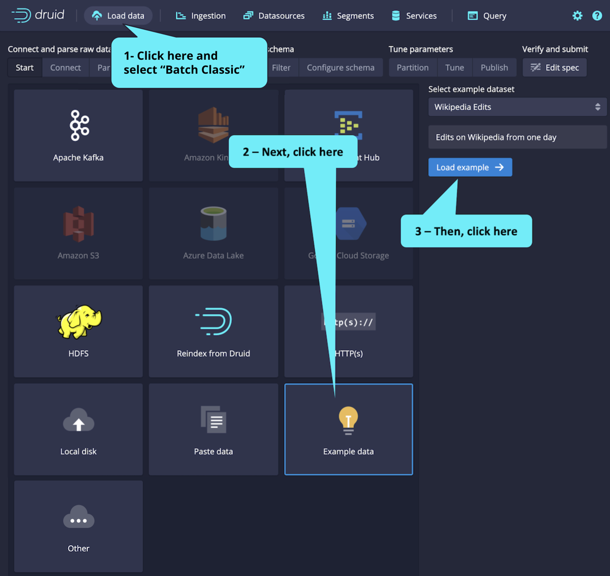
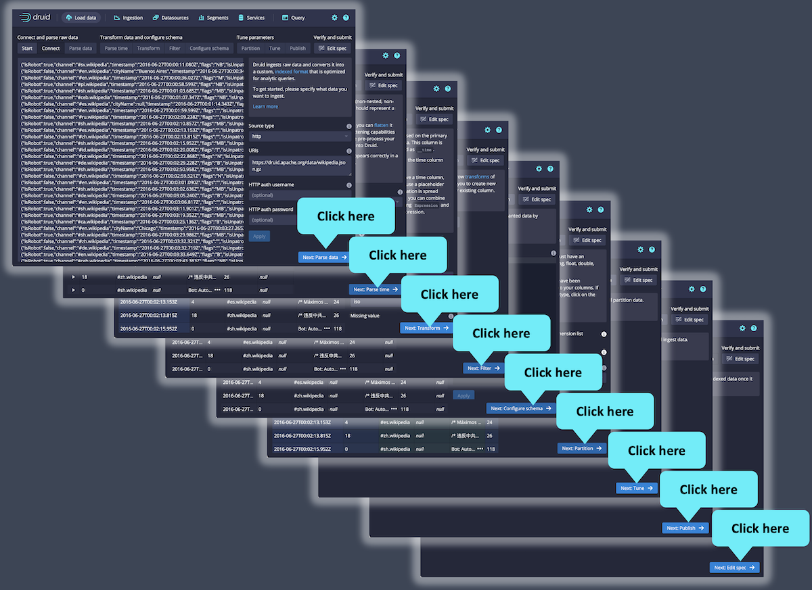
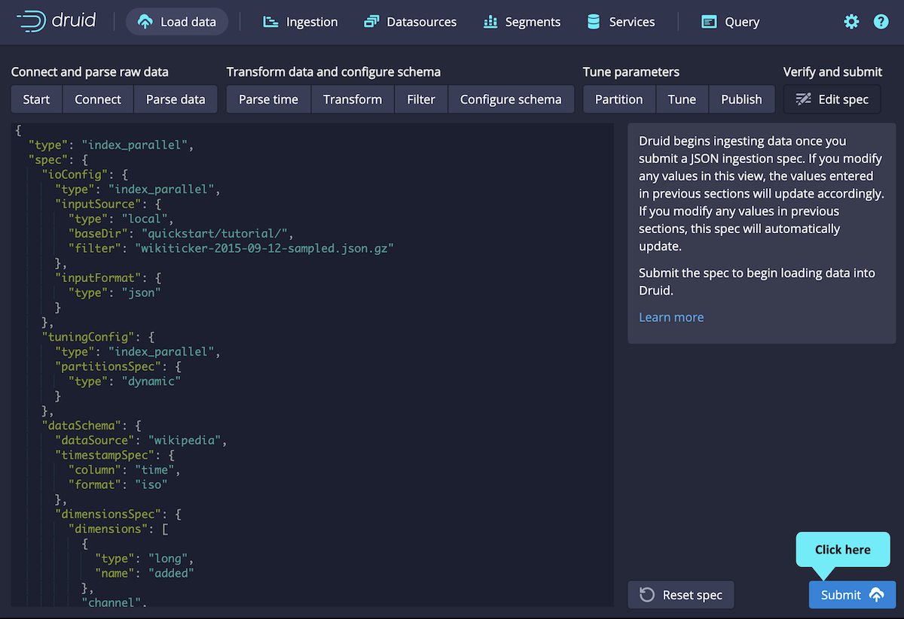
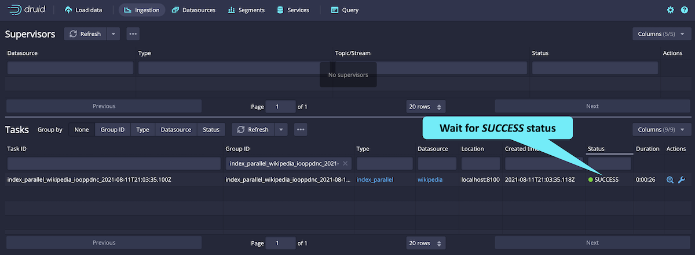
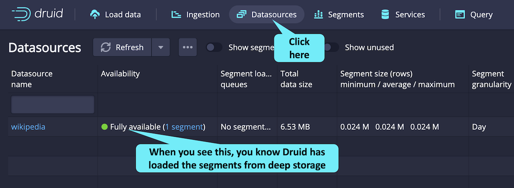

## INGESTION

There are two main approaches to ingesting Druid data

### 1. Batch ingestion

Druid Ingestion is about connecting and preparing data for Druid to use.

There are four main steps to ingestion. These steps include:

1. **Connect and parse raw data** - this is about getting the data into a usable format

   Load data by clicking as shown.

   

2. **Transform data and configure schema** - this step makes sure you have the right dimensions

   The console walks you through the ingestion steps. Since we are using example data, we can just accept the defaults by clicking the `Next`:...-> buttons.

   The ingestion takes a minute or so. You will know Druid has written the segments to deep storage when you see the SUCCESS status (you may have to scroll the window to the right).

   

   _**NOTE**: In this introductory track, we will not cover the details of ingestion, but the purpose of the previous screens through which we wildly clicked was to build an ingestion specification. You can review the JSON ingestion specification on left side of this final screen. You can learn about ingestion in the Druid Basics course and the Ingestion and Data Modeling course at [learn.imply.io](https://learn.imply.io/)._

3. **Tune parameters** - this step prepares the rows of data

   Finally, click `Submit` to ingest the data.

   
   

4. **Verify and submit** - the final step is for Druid to consume the data

   After Druid writes the segments to deep storage, it then loads the segments for querying. You can tell the segments are loaded and ready when you see this (you may need to refresh the browser tab a few times).

   

### 2. Stream ingestion via Kafka, etc

## RELATED

[1] [Install a single-node Druid deployment](1-installation.md)

[2] 📍 you're here

[3] [Perform queries on the sample data](3-querying.md)
