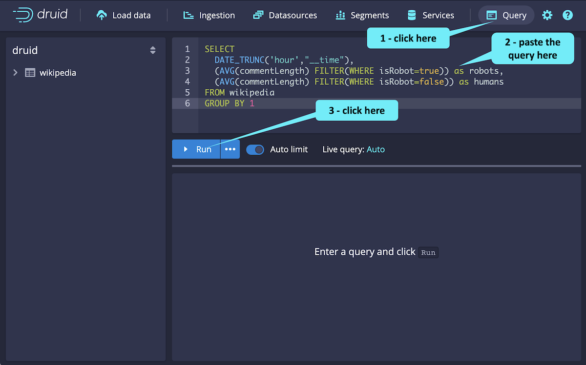

### Fun facts about Druid queries:

- we can use the Unified Druid Console and SQL
- Druid queries are well suited for aggregation and group-by queries
- given an appropriate data model, Druid queries is really fast - even at scale !

### Let's Query Druid

With Druid running and data ingested, let's execute a query using the Druid console.

**Step 1**

<hr/>

The ingested data is about updates to Wikipedia during a one day period. Both people and robots contributed to the updates.

Suppose you want to know how updates vary for humans and robots over time. Here's a query that can help you answer that question.

```
SELECT
  DATE_TRUNC('hour',"__time"),
  (AVG(commentLength) FILTER(WHERE isRobot=true)) as robots,
  (AVG(commentLength) FILTER(WHERE isRobot=false)) as humans
FROM wikipedia
GROUP BY 1
```

Click on the Query tab, paste the query in the console and run it as shown. Then, check out the results.


