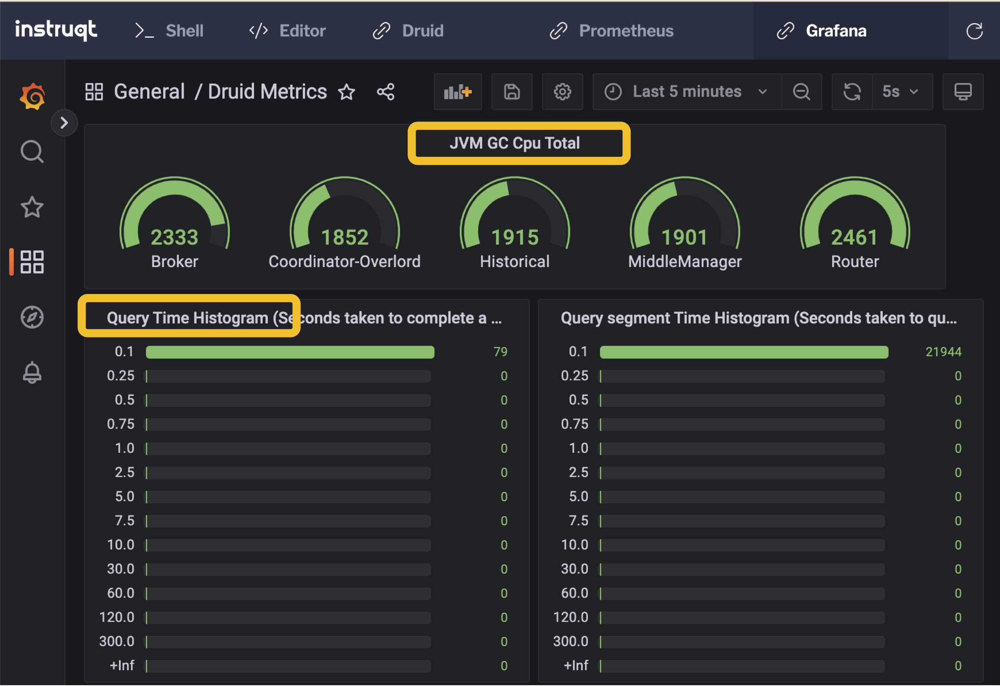

## INSTALL GRAFANA

In the previous exercises, we set up Druid to emit metrics to Prometheus. In this exercise we'll install Grafana so we can visualize the metrics.

Read more about Grafana [here](https://grafana.com/).

**Step 1**

<hr/>

Install Grafana.

```ruby
wget -q -O /usr/share/keyrings/grafana.key https://apt.grafana.com/gpg.key
echo "deb [signed-by=/usr/share/keyrings/grafana.key] https://apt.grafana.com stable main" | tee -a /etc/apt/sources.list.d/grafana.list
apt-get update
apt-get install grafana
sed -i 's/;allow_embedding = false/allow_embedding = true/g' \
  /etc/grafana/grafana.ini
sed -i 's/\[auth.anonymous\]/\[auth.anonymous\]\nenabled = true\norg_name = Main Org.\norg_role = Viewer/g' \
  /etc/grafana/grafana.ini
```

**Step 2**

<hr/>

We'll provision Grafana to use Prometheus as a data source by creating the following Grafana configuration file.

<details>

<summary>What does this file do?</summary>

Grafana needs to know what data source(s) to use and where to find the data source(s). In this file, we create a YAML list of data sources with a single entry for Prometheus. The notable fields in this entry include the type field, which tells Grafana to use the Prometheus protocol for querying the data source, and the _url_ field, which tells Grafana where to talk to the Prometheus data source.

Grafana will read this configuration file when it starts up and perform queries accordingly.

Alternatively, we could have added the data source using the Grafana console as detailed [here](https://prometheus.io/docs/visualization/grafana/).

</details>

```ruby
cat > /etc/grafana/provisioning/datasources/prom.yml << \EOF
apiVersion: 1

datasources:
- name: prometheusdata
  type: prometheus
  access: proxy
  orgId: 1
  url: http://localhost:9090
  isDefault: true
  version: 1
  editable: false
EOF
```

**Step 3**

<hr/>

We have provisioned a dashboard for this lab in the _/root/dashboards_ directory. Create the following file, which tells Grafana where to find the dashboard.

```ruby
cat > /etc/grafana/provisioning/dashboards/dashboards.yml << \EOF
apiVersion: 1

providers:

- name: dashboards
  type: file
  updateIntervalSeconds: 30
  allowUiUpdates: true
  options:
  path: /root/dashboards
  foldersFromFilesStructure: true
  EOF
```

**Step 4**

<hr/>

Start Grafana as a service.

```ruby
service grafana-server start > /dev/null
```

**Step 5**

<hr/>

View the Druid Metrics dashboard.

**NOTE**: _This is an example dashboard that demonstrates some of the various views available for Druid metrics in Grafana. In your own deployment, you would want to configure a dashboard specifically tailored to your needs. Read more about creating Grafana dashboards [here](https://grafana.com/docs/grafana/latest/dashboards/build-dashboards/).
View Dashboard_

**Step 6**

<hr/>

Let's create some Druid activity by ingesting and querying data.

```ruby
TASK_ID=$(curl -XPOST \
  -H'Content-Type: application/json'   \
  http://localhost:8888/druid/v2/sql/task \
  -d @/root/ingestion.json \
  | tee >(jq > /dev/tty) \
  | jq -r '.taskId')
sleep 3
while [ $(curl  -H'Content-Type: application/json' http://localhost:8888/druid/indexer/v1/task/$TASK_ID/reports  2> /dev/null \
  | jq .multiStageQuery.payload.status.status 2> /dev/null \
  | grep SUCCESS | wc -w) -eq 0 ]; \
  do
    echo "Waiting for ingestion to complete..."
     sleep 3
  done
echo "Ingestion completing"
sleep 5
```

**Step 7**

<hr/>

Finally, execute the following (which will run forever) to create query activity.

```ruby
while true
do
  curl -s -X 'POST' \
    -H 'Content-Type:application/json' \
    -d @/root/query.json http://localhost:8888/druid/v2/sql \
    | jq
done
```

**Step 8**

<hr/>

Switch back to the Grafana Console and investigate the effects of the Druid activity.



At the top of the dashboard, you see the current JVM garbage collection CPU activity by process. Next on the page you see query-related histograms. The query activity we are introducing here isn't very interesting, so all the queries are very fast (probably less than 0.1 second) - we will address more interesting workloads in the Clarity labs. You can scroll down further in the dashboard to see other example metrics and ways to display them.

Notice that the Grafana dashboard is more helpful than the Prometheus console because we can label the various process-related metrics with the process names. Also, we can correlate various metrics within a single view.

However, if you have ever tried to create Grafana dashboards, you will realize that it can be a bit of a tedious art-form. This is why Clarity is a very helpful product - Clarity gives you a tailored view of Druid metrics with none of the configuration tedium.
