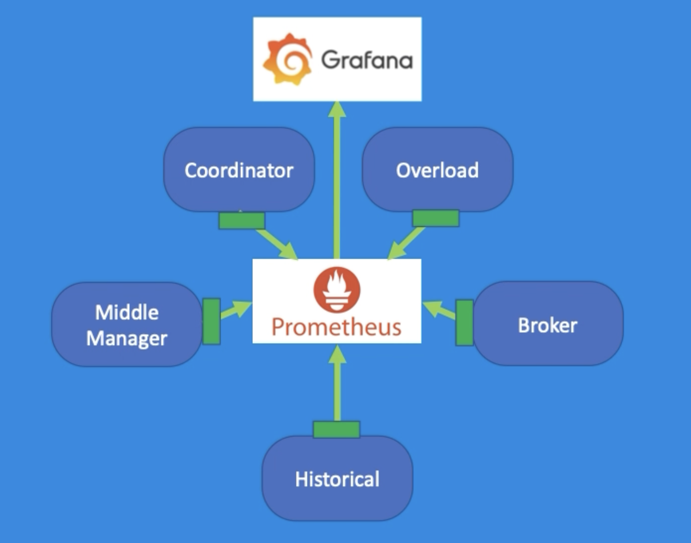

### About this part

Druid's distributed design and optimized data storage format make it awesome for large-scale, massively parallel processing and storage. When systems based on this design have issues metrics can help you understand where the problems are.

### Outcome

- Enable metrics gathering
- Extend the basic metrics that Druid emits
- Create a Prometheus and Grafana metrics pipeline for viewing metrics

  

- Use Kafka and Clarity for optimal metrics interactive viewing

### What do we need?

Familiarity with Linux is a bonus, but by no means a prerequisite.

## CURRICULUM

WELCOME TO APACHE DRUID® METRICS

📄 [Introduction](./5.1-welcome/introduction.md)

📄 [Learn More](./5.1-welcome/learn-more.md)

APACHE DRUID® METRICS BASICS

📄 [Introduction](./5.2-basics/introduction.md)

⤷ [Enable metrics and understand the different types of metrics](./5.2-basics/1-configuration.md)

📄 [Learn More](./5.2-basics/learn-more.md)

APACHE DRUID® MONITORS

📄 [Introduction](./5.3-monitors/introduction.md)

⤷ [Configuring Druid with monitors](./5.3-monitors/1-monitoring.md)

📄 [Learn More](./5.3-monitors/learn-more.md)

VIEWING APACHE DRUID® METRICS WITH PROMETHEUS AND GRAFANA

📄 [Introduction](./5.4-grafana-prometheus/introduction.md)

⤷ [Provide a way to monitor system health](./5.4-grafana-prometheus/1-view-metrics.md)

📄 [Learn More](./5.4-grafana-prometheus/learn-more.md)

