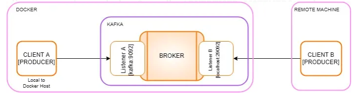

## 💡 Overview

**Kafka** is all about events. Events are organized in topics and categorized into partitions. These streams of events can then be used to build Publish/Subscribe systems or a Message Queues, which processes messages in parallel.


**Prometheus** to pull metrics from **Kafka** and then visualize the important metrics on a **Grafana** dashboard.

### Monitoring

A few metrics are super important to have

- Number of active controller: should always be 1
- Number of Under Replicated Partitions: should always be 0
- Number of Offline Partitions: should always be 0

There are a ton of metrics you can find online:

- https://kafka.apache.org/documentation/#monitoring
- https://docs.confluent.io/platform/current/kafka/monitoring.html

It's better to have more metrics monitored than less to easily troubleshoot issues when they raise

## Kafka Primer for Docker

### bootstrap.server

- connecting from remote client machine different from docker running kafka

  ```
  localhost:29094
  ```

- connecting from docker machine running kafka

  ```
  localhost:29092
  ```

### jmx.metrics

- localhost:29103
- download and add jmx exporter jar if you need metrics and can comment line "EXTRA_ARGS"
- download location: https://github.com/prometheus/jmx_exporter

### Kafka Listeners

There are two types of listeners

- **LISTENER** - are what interfaces Kafka binds to. This is for clients connecting on Docker
- **ADVERTISED_LISTENERS** - re how external clients can connect to Kafka and this is for clients connecting outside of the Docker machine.



## ⚙️ Installation

```ruby
cd helpers/docker-compose/kafka # skip this command if you're already in kafka folder
docker-compose up
```

## Actions

After direct to `kafka` folder, follow these actions to interact with the data

| Action                           | Command                                                                                                                                                     |
| -------------------------------- | ----------------------------------------------------------------------------------------------------------------------------------------------------------- |
| Access to the container          | `docker exec -it --user root kafka bash`                                                                                                                    |
| Install and list all the sockets | `yum install net-tools` <br/> `netstat -an`                                                                                                                 |
| Kafka Producer                   | `docker run -it --rm --network kafka_docker_example_net confluentinc/cp-kafka /bin/kafka-console-producer --bootstrap-server kafka:9092 --topic test_topic` |
| Kafka Consumer                   | `docker run -it --rm --network kafka_docker_example_net confluentinc/cp-kafka /bin/kafka-console-consumer --bootstrap-server kafka:9092 --topic test_topic` |

Open two terminals in parallel to see the producer and consumer work


## 📚 References

- [How to Connect to Apache Kafka running in Docker](https://www.youtube.com/watch?v=L--VuzFiYrM)
- [The Ultimate Guide of Using Kafka with Node.js](https://www.youtube.com/watch?v=gTwXG8lC2GM)
- [Apache Kafka Monitoring & Operations](https://www.youtube.com/watch?v=XXLe0KNEbR4&list=PLt1SIbA8guuvO1n-DB-BSFRXBB8Y6VVbS)
- [Kafka Primer for Docker](https://levelup.gitconnected.com/kafka-primer-for-docker-how-to-setup-kafka-start-messaging-and-monitor-broker-metrics-in-docker-b4e018e205d1)
- [Infra Docker Kubernetes](https://github.com/rohsin47/infra-docker-kubernetes/tree/main/docker/jmx-exporter)
